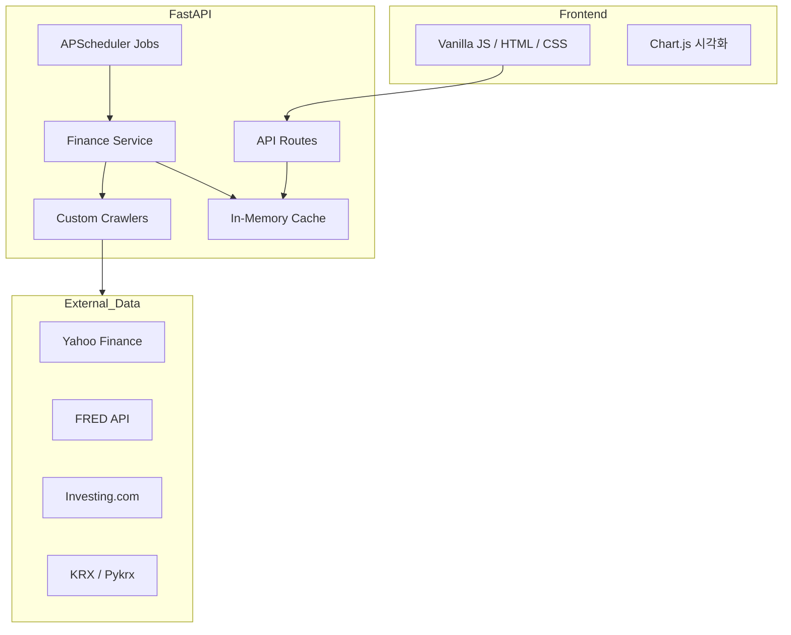

# ARCHITECTURE.md - USA Invest Dashboard

## 1. 개요
본 프로젝트는 미국 및 글로벌 주요 경제 지표, 주식, 채권 금리, 환율 정보를 수집하여 시각화하는 웹 대시보드입니다.

## 2. 시스템 아키텍처

### 2.1 Component Diagram

### 2.2 기술 스택
- **Backend**: Python 3.10+, FastAPI, APScheduler
- **Frontend**: HTML5, Vanilla JavaScript, TailwindCSS (CDN), Chart.js
- **Data Source**: yfinance, FRED API, requests/BeautifulSoup4 (Crawling), pykrx

## 3. 핵심 설계 원칙
- **In-Memory Caching**: 외부 API 호출 횟수를 최소화하고 빠른 응답을 위해 수집된 데이터를 메모리에 캐싱합니다.
- **Background Jobs**: 실시간 데이터(30초/5분 단위)와 일간 데이터(00:00, 12:00)를 비동기적으로 수집합니다.
- **Memory Optimization**: Render Free 인스턴스의 메모리 제한(512MB)을 고려하여 Startup Job을 순차적으로 실행하고 지연 시간을 둡니다.

## 4. 데이터 흐름
1. 서버 시작 시 `run_startup_jobs`가 실행되어 초기 데이터를 채웁니다.
2. `APScheduler`가 정해진 주기에 따라 `finance_service`를 호출하여 데이터를 갱신합니다.
3. 수집된 데이터는 `CACHE` 딕셔너리에 저장됩니다.
4. 사용자가 대시보드 접속 시 `/api/finance/...` 엔드포인트를 통해 캐시된 데이터를 브라우저로 전달합니다.
5. Frontend에서는 전달받은 데이터를 기반으로 화면을 렌더링하고 차트를 그립니다.
